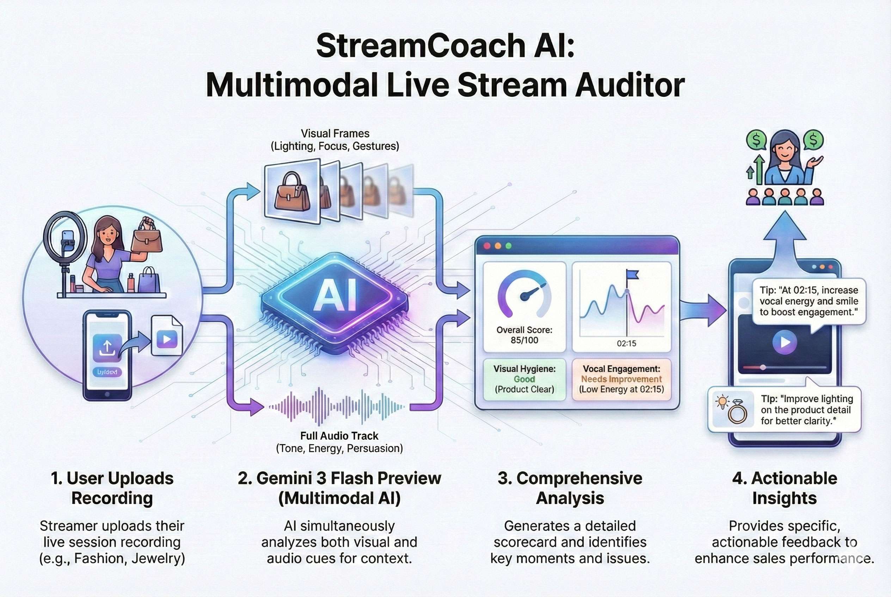

# StreamCoach AI 🎥🚀

**Elevate Your Live Stream Sales with Multimodal AI Audits.**

StreamCoach AI is a powerful web application designed to automatically analyze the performance quality of live streams. Powered by **Google Gemini 3 Flash Preview**, it acts as a virtual consultant, auditing both the visual presentation and audio delivery of your stream to provide actionable, timestamped feedback that helps boost engagement and sales conversion.



---

## ✨ Key Features

*   **Multimodal Analysis**: "Sees" your product presentation (lighting, clarity, gestures) and "hears" your sales pitch (tone, enthusiasm, pacing) simultaneously.
*   **Timeline Analysis**: Identifies specific moments (timestamped flags) where issues occurred, such as "dead air," "product blur," or "low energy."
*   **Instant Scoring**: Provides an objective 0-100 performance score based on industry standards for categories like Jewelry, Fashion, Gaming, and General Sales.
*   **Privacy-First & Secure**:
    *   **BYOK (Bring Your Own Key)**: Your Google Gemini API Key is stored safely in your browser's **LocalStorage**, never on our servers.
    *   **Auto-Cleanup**: Video files are processed immediately and deleted from the server to ensure data privacy and save storage space.
*   **PDF Reports**: Export your audit results into a professional PDF format for offline review and coaching.
*   **Cost-Effective**: Optimized for Gemini 3 Flash Preview for high-speed, low-cost analysis.

---

## 🛠️ Tech Stack

*   **Backend**: Go (Golang)
*   **AI Engine**: Google GenAI SDK (Gemini 3 Flash Preview)
*   **Video Processing**: FFmpeg (Frame extraction & Audio separation)
*   **Frontend**: Vue.js 3 (Composition API)
*   **Styling**: Tailwind CSS
*   **PDF Generation**: jsPDF & AutoTable

---

## ⚙️ Prerequisites

Before running the application, ensure you have the following installed:

1.  **Go** (version 1.21 or higher) - [Download Go](https://go.dev/dl/)
2.  **FFmpeg** - [Download FFmpeg](https://ffmpeg.org/download.html)
    *   *Crucial*: Ensure `ffmpeg` is added to your system's PATH variable so it can be executed from the command line.
3.  **Google Gemini API Key** - [Get a free key](https://aistudio.google.com/app/apikey)

---

## 🚀 Installation & Setup

1.  **Clone the Repository**
    ```bash
    git clone https://github.com/yourusername/streamcoach-ai.git
    cd streamcoach-ai
    ```

2.  **Install Go Dependencies**
    ```bash
    go mod tidy
    ```

3.  **Verify FFmpeg**
    Ensure FFmpeg is accessible:
    ```bash
    ffmpeg -version
    ```

4.  **Build the Application**
    ```bash
    go build -o streamcoach.exe
    ```

5.  **Run the Server**
    ```bash
    ./streamcoach.exe
    ```

6.  **Access the App**
    Open your browser and navigate to:
    ```
    http://localhost:8080
    ```

---

## 📖 How to Use

1.  **Dashboard**: Landing page explaining the tool's value. Click "Analyze Now".
2.  **API Key Setup**: You will be prompted to enter your Gemini API Key. This is saved in your browser so you don't need to re-enter it every time.
3.  **Upload & Analyze**:
    *   Select your stream category (e.g., Jewelry, Fashion).
    *   Upload a video file (MP4/MOV, suggested < 50MB for the demo).
    *   Click "Analyze Stream".
4.  **View Results**: Watch the progress bar as the AI extracts frames and audio.
5.  **Review Audit**:
    *   Check your **Overall Score**.
    *   Read the **Executive Summary**.
    *   Review **Strengths & Weaknesses**.
    *   Analyze the **Timeline Flags** for specific moments to fix.
    *   Read the **Coach's Advice**.
6.  **Export**: Click "Export PDF" to save your report.

---

## 🔒 Security & Privacy

*   **No Persistent Storage**: We do not store your API keys or video files on the backend.
*   **Ephemeral Processing**: Videos are uploaded to a temporary folder, processed by FFmpeg, and **immediately deleted**. The extracted frames and audio are also deleted as soon as the Gemini analysis is complete.

---

## 🤝 Contribution

This project was built for the **Gemini Hackathon**. Feedback and contributions are welcome!

1.  Fork the repository.
2.  Create your feature branch (`git checkout -b feature/AmazingFeature`).
3.  Commit your changes (`git commit -m 'Add some AmazingFeature'`).
4.  Push to the branch (`git push origin feature/AmazingFeature`).
5.  Open a Pull Request.

---

## 📄 License

Distributed under the MIT License. See `LICENSE` for more information.
